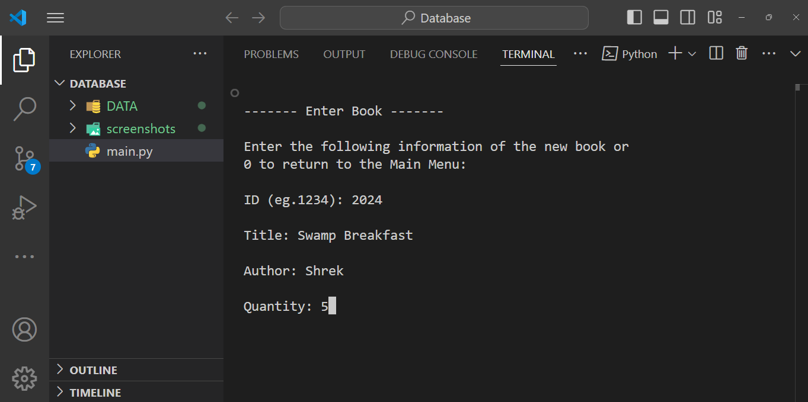
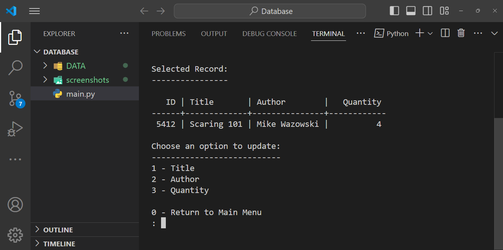
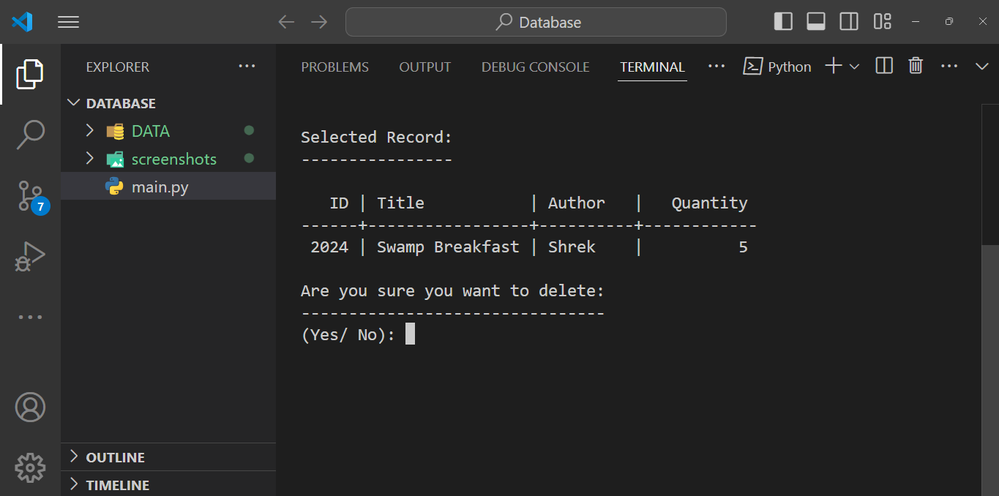

Book Manager v0.1 (CLI)

Book Manager is a command-line interface (CLI) application designed to manage a collection of books using a SQLite database. It allows users to add, update, delete, search, and view book records.

## Table of Contents

1. [Features](#features)
2. [Requirements](#requirements)
3. [Installation](#installation)
4. [Usage](#usage)
5. [Credits](#credits)

## Features

- **Enter a Book**: Add a new book to the database.
- **Update a Book**: Modify details of an existing book.
- **Delete a Book**: Remove a book from the database.
- **Search Books**: Find books by ID, title, or author.
- **View All Books**: Display all books in the database.

## Requirements

- Python 3.x
- SQLite3

## Installation

- **Clone the Repository:**
    Clone the repository using git clone https://github.com/EzraMoosa/bookmanager.git

## Usage
- **Start Application:**
    Open your terminal, navigate to the project directory, and type:
    python main.py

- **Menu Options:**
    * Enter a Book: Add a new book to the database.
    * Update a Book: Modify details of an existing book.
    * Delete a Book: Remove a book from the database.
    * Search Books: Find books by ID, title, or author.
    * View All Books: Display all books in the database.
    * Exit: Close the application.
 
- **Screenshots:**
    Main Menu:
    
  
    Enter a Book:
    
  
    Update a Book:
    
  
    Delete a Book:
    
  
    Search Books:
    
  
    View All Books:
    

## Credits
This project was made possible by the contributions of the following individuals:
- **[Ezra Moosa](https://github.com/EzraMoosa)**

For more information, visit the [Book Manager Repository](https://github.com/EzraMoosa/bookmanager).

